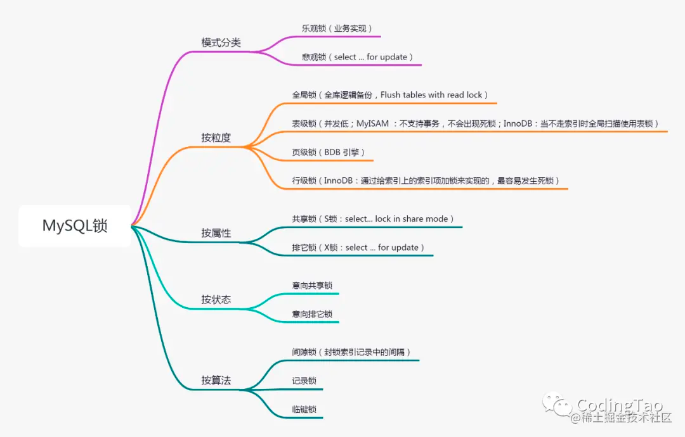

### Mysql的各种锁

#### 全局锁
- 对整个数据库实例加锁，常用于对数据库进行备份。命令：Flush tables with read lock (FTWRL)
#### 表级锁
- Mysql的表级锁包含 表锁，元数据锁（MDL）
- 实现方式：lock tables ... read/write
- 元数据锁：MDL不需要显示使用，在访问一个表的时候会默认加上。当对表机构更改时默认添加MDL写锁，其他就是MDL读锁
#### 行级锁
- Mysql中只有InnDB引擎支持行锁，行锁也分为共享锁和拍它锁
- 在MySQL中，行级锁并不是直接锁记录，而是锁索引。索引分为主键索引和非主键索引两种，如果一条sql语句操作了主键索引，MySQL就会锁定这条主键索引；如果一条语句操作了非主键索引，MySQL会先锁定该非主键索引，再锁定相关的主键索引。在UPDATE、DELETE操作时，MySQL不仅锁定WHERE条件扫描过的所有索引记录，而且会锁定相邻的键值，即所谓的next-key locking。
#### 共享锁
- 共享锁，又称之为读锁，简称S锁，当事务A对数据加上读锁后，其他事务只能对该数据加读锁，不能做任何修改操作，也就是不能添加写锁。只有当事务A上的读锁被释放后，其他事务才能对其添加写锁。
- 共享锁主要是为了支持并发的读取数据而出现的，读取数据时，不允许其他事务对当前数据进行修改操作，从而避免”不可重读”的问题的出现。
  适合于两张表存在关系时的写操作，拿mysql官方文档的例子来说，一个表是child表，一个是parent表，假设child表的某一列child_id映射到parent表的c_child_id列，那么从业务角度讲，此时我直接insert一条child_id=100记录到child表是存在风险的，因为刚insert的时候可能在parent表里删除了这条c_child_id=100的记录，那么业务数据就存在不一致的风险。正确的方法是再插入时执行select * from parent where c_child_id=100 lock in share mode,锁定了parent表的这条记录，然后执行insert into child(child_id)values (100)就不会存在这种问题了。
- 实现方式：select ... lock in share mode
#### 排他锁
- 排它锁，又称之为写锁，简称X锁，当事务对数据加上写锁后，其他事务既不能对该数据添加读写，也不能对该数据添加写锁，写锁与其他锁都是互斥的。只有当前数据写锁被释放后，其他事务才能对其添加写锁或者是读锁。
- 写锁主要是为了解决在修改数据时，不允许其他事务对当前数据进行修改和读取操作，从而可以有效避免”脏读”问题的产生。
- 实现方式： select ... for update
#### 意向共享锁和意向排他锁
- 意向锁是表锁，为了协调行锁和表锁的关系，支持多粒度（表锁与行锁）的锁并存。
- 当有事务A有行锁时，MySQL会自动为该表添加意向锁，事务B如果想申请整个表的写锁，那么不需要遍历每一行判断是否存在行锁，而直接判断是否存在意向锁，增强性能。
#### 间隙锁、临键锁、记录锁
- 记录锁、间隙锁、临键锁都是排它锁，而记录锁的使用方法跟排它锁介绍一致。
- 记录锁：记录锁是封锁记录，记录锁也叫行锁，例如：
select *from goods where **`id`=**1 for update;
它会在 id=1 的记录上加上记录锁，以阻止其他事务插入，更新，删除 id=1 这一行。
- 间隙锁：间隙锁基于非唯一索引，它锁定一段范围内的索引记录。使用间隙锁锁住的是一个区间，而不仅仅是这个区间中的每一条数据。
  select* from goods where id between 1 and 10 for update;
  即所有在（1，10）区间内的记录行都会被锁住，所有id 为 2、3、4、5、6、7、8、9 的数据行的插入会被阻塞，但是 1和 10 两条记录行并不会被锁住。
- 临键锁：临键锁，是记录锁与间隙锁的组合，它的封锁范围，既包含索引记录，又包含索引区间，是一个左开右闭区间。
- 临键锁的主要目的，也是为了避免幻读(Phantom Read)。如果把事务的隔离级别降级为RC，临键锁则也会失效。
  每个数据行上的非唯一索引列上都会存在一把临键锁，当某个事务持有该数据行的临键锁时，会锁住一段左开右闭区间的数据。需要强调的一点是，InnoDB 中行级锁是基于索引实现的，临键锁只与非唯一索引列有关，在唯一索引列（包括主键列）上不存在临键锁。

### Mysql-主从复制和读写分离
#### 主从复制
主要涉及三个线程：binlog线程、IO线程和SQL线程
- binlog 线程 : 负责将主服务器上的数据更改写入二进制日志中。
- I/O 线程 : 负责从主服务器上读取二进制日志，并写入从服务器的中继日志中。
- SQL 线程 : 负责读取中继日志并重放其中的 SQL 语句。
#### 读写分离
主服务器处理写操作以及实时性要求比较高的读操作，而从服务器处理读操作。
读写分离能提高性能的原因在于:
- 主从服务器负责各自的读和写，极大程度缓解了锁的争用；
- 从服务器可以使用 MyISAM，提升查询性能以及节约系统开销；
- 增加冗余，提高可用性。
    读写分离常用代理方式来实现，代理服务器接收应用层传来的读写请求，然后决定转发到哪个服务器。

### Mysql 的InnDB的MVCC实现机制
MVCC的目的就是多版本并发控制，在数据库中的实现，就是为了解决读写冲突，它的实现原理主要是依赖记录中的 4个隐式字段，undo日志 ，Read View 来实现的。
#### 隐式字段
- 事务Id
- 回滚指针
- 主键Id
- 标志位
#### undo log
每一次更新（update，insert，delete）操作都会生成一条undo log日志，最终会形成一条版本数据链
#### 读视图（Read view）
什么是Read View，说白了Read View就是事务进行快照读操作的时候生产的读视图(Read View)，在该事务执行的快照读的那一刻，会生成数据库系统当前的一个快照，
记录并维护系统当前活跃事务的ID(当每个事务开启时，都会被分配一个ID, 这个ID是递增的，所以最新的事务，ID值越大)

- 所以总结来说mvcc的实现机制就是：隐式字段+undo log形成版本链，然后根据mysql可见性算法+read view通过不加锁的方式解决并发情况下的读写问题，提高性能。

