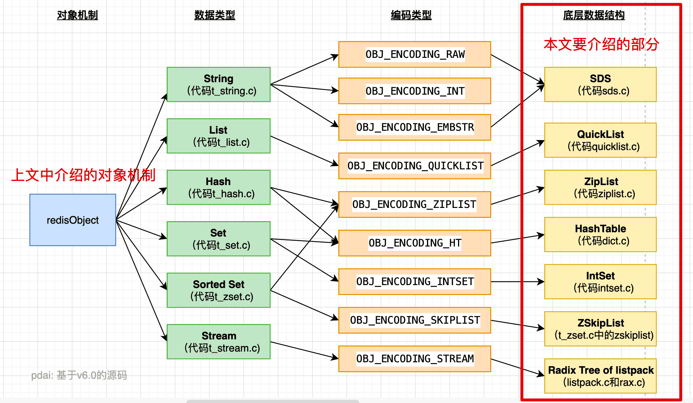

### redis为什么快？用途？
- redis基于内存，内存访问速度是磁盘上千倍，单机轻松到达10W qps
- redis基于Reactor模式设计开发了一套高效的事件处理模型。主要通过单线程事件循环+IO多路复用
- redis 内置多种数据结构，性能很高
- 用途：缓存，消息队列，分布式锁，限流（redis+luma脚本）
### redis的持久化机制
两种持久化方法：快照（RDB）和 追加文件（AOF）
- RDB 比 AOF 优秀的地方 ：

    RDB 文件存储的内容是经过压缩的二进制数据， 保存着某个时间点的数据集，文件很小，适合做数据的备份，灾难恢复。AOF 文件存储的是每一次写命令，类似于 MySQL 的 binlog 日志，通常会必 RDB 文件大很多。当 AOF 变得太大时，Redis 能够在后台自动重写 AOF。新的 AOF 文件和原有的 AOF 文件所保存的数据库状态一样，但体积更小。不过， Redis 7.0 版本之前，如果在重写期间有写入命令，AOF 可能会使用大量内存，重写期间到达的所有写入命令都会写入磁盘两次。
使用 RDB 文件恢复数据，直接解析还原数据即可，不需要一条一条地执行命令，速度非常快。而 AOF 则需要依次执行每个写命令，速度非常慢。也就是说，与 AOF 相比，恢复大数据集的时候，RDB 速度更快。
- AOF 比 RDB 优秀的地方 ：

    RDB 的数据安全性不如 AOF，没有办法实时或者秒级持久化数据。生成 RDB 文件的过程是比繁重的， 虽然 BGSAVE 子进程写入 RDB 文件的工作不会阻塞主线程，但会对机器的 CPU 资源和内存资源产生影响，严重的情况下甚至会直接把 Redis 服务干宕机。AOF 支持秒级数据丢失（取决 fsync 策略，如果是 everysec，最多丢失 1 秒的数据），仅仅是追加命令到 AOF 文件，操作轻量。
RDB 文件是以特定的二进制格式保存的，并且在 Redis 版本演进中有多个版本的 RDB，所以存在老版本的 Redis 服务不兼容新版本的 RDB 格式的问题。
AOF 以一种易于理解和解析的格式包含所有操作的日志。你可以轻松地导出 AOF 文件进行分析，你也可以直接操作 AOF 文件来解决一些问题。比如，如果执行FLUSHALL命令意外地刷新了所有内容后，只要 AOF 文件没有被重写，删除最新命令并重启即可恢复之前的状态。
### Redis底层数据结构

- SDS 动态字符串
- ZipList 双向链表
- QuickList 它是一种以ziplist为结点的双端链表结构. 宏观上, quicklist是一个链表, 微观上, 链表中的每个结点都是一个ziplist。
- Dict 字典
- IntSet 整数集合（intset）是集合类型的底层实现之一，当一个集合只包含整数值元素，并且这个集合的元素数量不多时，Redis 就会使用整数集合作为集合键的底层实现。
- ZSkipList 跳跃表结构在 Redis 中的运用场景只有一个，那就是作为有序列表 (Zset) 的使用。跳跃表的性能可以保证在查找，删除，添加等操作的时候在对数期望时间内完成，这个性能是可以和平衡树来相比较的，而且在实现方面比平衡树要优雅，这就是跳跃表的长处。跳跃表的缺点就是需要的存储空间比较大，属于利用空间来换取时间的数据结构。

### Redis性能调优
- 首先对redis进行基准测试方能知道是否变慢，多少才算慢。
- 接着查看redis的慢日志命令：SLOWLOG get 5
- 接着就是分析原因了
  - 使用复杂度过高的命令
  - 操作Bigkey
  - key集中过期：原因就是redis的主动过期策略，redis内部会有一个定时任务去跑，然后剔除掉过期的key。而这个定时任务是在主线程跑的，所以。
  - 内存达到上限
  - fork耗时严重
  - 开启AOF，策略为always：主线程每次执行写操作后立即刷盘，此方案会占用比较大的磁盘 IO 资源
  - 碎片整理
  - 使用Swap