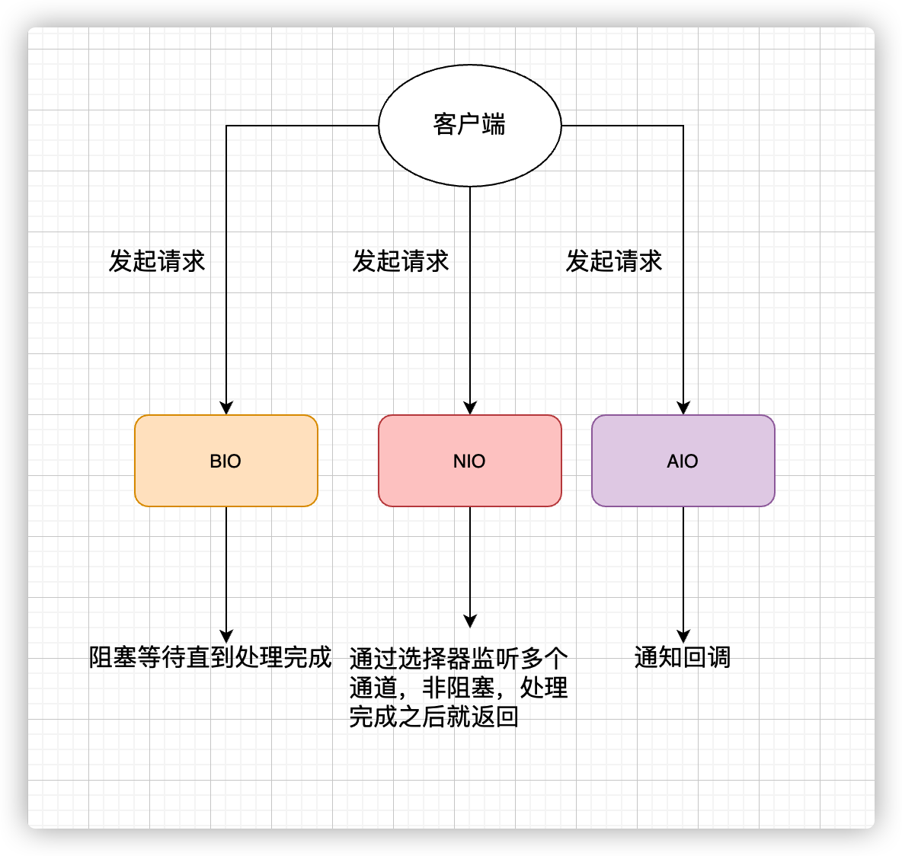
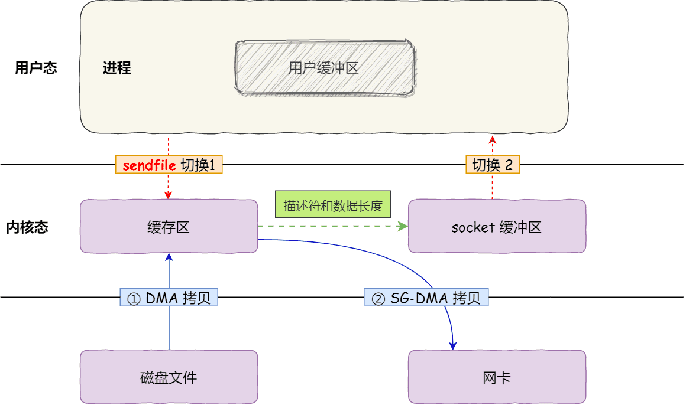

### Java中常见的3种IO 模型
- BIO 同步阻塞IO
    应用程序发起read调用后，会一只阻塞，知道内核把数据拷贝到用户空间
- NIO 非阻塞IO
  实际上还是会阻塞的（数据从内核空间 -> 用户空间）
- AIO 异步IO 真正的非阻塞IO
  异步 IO 是基于事件和回调机制实现的，也就是应用操作之后会直接返回，不会堵塞在那里，当后台处理完成，操作系统会通知相应的线程进行后续的操作。
  

### 零拷贝
- 传统的read（）/write（）调用会发生四次数据拷贝（复制）
- mmap+write 只减少了一次数据拷贝（内核到用户态数据拷贝）
- sendfile（）如果网卡支持SG-DMA就是真正的零拷贝

  这就是所谓的零拷贝（Zero-copy）技术，因为我们没有在内存层面去拷贝数据，也就是说全程没有通过 CPU 来搬运数据，所有的数据都是通过 DMA 来进行传输的。零拷贝技术的文件传输方式相比传统文件传输的方式，减少了 2 次上下文切换和数据拷贝次数，只需要 2 次上下文切换和数据拷贝次数，就可以完成文件的传输，而且 2 次的数据拷贝过程，都不需要通过 CPU，2 次都是由 DMA 来搬运

### 什么是IO多路复用？
这里的多路指的是多个文件描述符（fd），复用指的是复用一个线程/进程。
所以IO多路复用就是指一个线程处理多个socket。在网络服务中，IO多路复用起的作用是一次性把多个连接的事件通知业务处理。至于这些事件的处理方式，
到底是业务代码循环处理、丢到队列中，还是交给线程池处理，又业务代码决定
#### 有哪些实现？
- select
  - 轮询（1024限制）
  - 遍历数组
- poll
  - 轮询（无限制 ）
  - 遍历链表
- epoll
  - 不是轮询的方式，用户socket对应的fd注册进epoll，然后epoll帮你监听哪些socket上有消息到达
  - epoll 使用红黑树 (RB-tree) 数据结构来跟踪当前正在监视的所有文件描述符。
  - 只有活跃可用的FD才会调用callback函数；
- kqueue
  - 与epoll类似，不过是在类unix下的实现
#### IO多路复用与reactor
