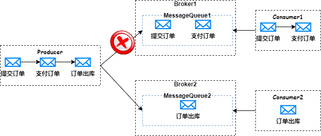

### RocketMQ如何保证消息有序性？
- 全局有序？ 不支持，除非只有一个队列
- 局部有序？ 也就是组内有序（单个队列有序）
  - 消息发送有序 ：RocketMQ 顺序消息的原理是在 Producer 端把一批需要保证顺序的消息发送到同一个 MessageQueue
  - 消息存储有序：broker内一个队列的消息是可以保证有序的
  - 消息消费有序：Consumer 端则通过加锁的机制来保证消息消费的顺序性，Broker 端通过对 MessageQueue 进行加锁，保证同一个 MessageQueue 只能被同一个 Consumer 进行消费。
 原理是给consumer注入的MessageListenerOrderly对象，在RocketMQ内部就会通过锁队列的方式保证消息是一个一个队列来取的。而MessageListenerConcurrently这个消息监听器则不会锁队列，
 每次都是从多个Message中取一批数据（默认不超过32条），这是有问题的。
- 可能的问题？
  - 有顺序性的消息需要发送到同一个 MessageQueue，可能导致单个 MessageQueue 消息量很大，而 Consumer 端消费的时候只能单线程消费，很可能导致当前 MessageQueue 消息积压；
  - 如果顺序消息 MessageQueue 所在的 broker 挂了，这时 Producer 只能把消息发送到其他 Broker 的 MessageQueue 上，而如果新的 MessageQueue 被其他 Consumer 消费，这样两个 Consumer 消费的消息就不能保证顺序性了。
如下图：

### RocketMQ如何处理消息堆积问题？
- 扩容增加消费实例
- 使用临时topic队列扩容

### RabbitMQ有哪些工作模式？
 - 简单模式
 - work工作模式
 - pub/sub发布订阅模式
 - Routing路由模式
 - Topic主题模式

### 如何保证消息的可靠性？
  RabbitMQ：
  - 生产者到 RabbitMQ：事务机制和 Confirm 机制，注意：事务机制和 Confirm 机制是互斥的，两者不能共存，会导致 RabbitMQ 报错。
  - RabbitMQ 自身：持久化、集群、普通模式、镜像模式。
  - RabbitMQ 到消费者：basicAck 机制、死信队列、消息补偿机制。
  RocketMQ：
  - 消息发送方：通过不同的重试策略保证了消息的可靠发送；
  - Broker服务端：通过不同的刷盘机制以及主从复制来保证消息的可靠存储；
  - 消息消费方：通过至少消费成功一次以及消费重试机制来保证消息的可靠消费；
### RocketMQ为什么快？
  - 顺序写：顺序写比随机写的性能会高很多，不会有大量寻址的过程
  - 异步刷盘：
  - 零拷贝：使用mmap的方式进行零拷贝，提高了数据传输的效率
### 如何保证消息不重复消费？
  - ack机制，offset机制 可以保证但是不能完全保证
  - 本质上其实是接口幂等问题，解决方案有：
    - 使用redis的setnx命令，但要注意ttl
    - 使用全局唯一Id
    - 基于数据库的唯一键
### 消息队列和线程池使用场景？
  - 个人理解消息队列更适合解耦场景，比如：日志收集
  - 消息队列更适合分布式场景，线程池适合单机业务处理
  - 线程池其实既充当生产者有充当消费者，不够灵活。而消息队列生产者，消费者都可以部署到不同的机器上
  - 消息队列会增加系统的复杂度。网络抖动怎么办，队列长度怎么设置，消息堆积问题怎么处理等等
  - 在不同的服务之间调用使用线程池很难实现或者开销很大

